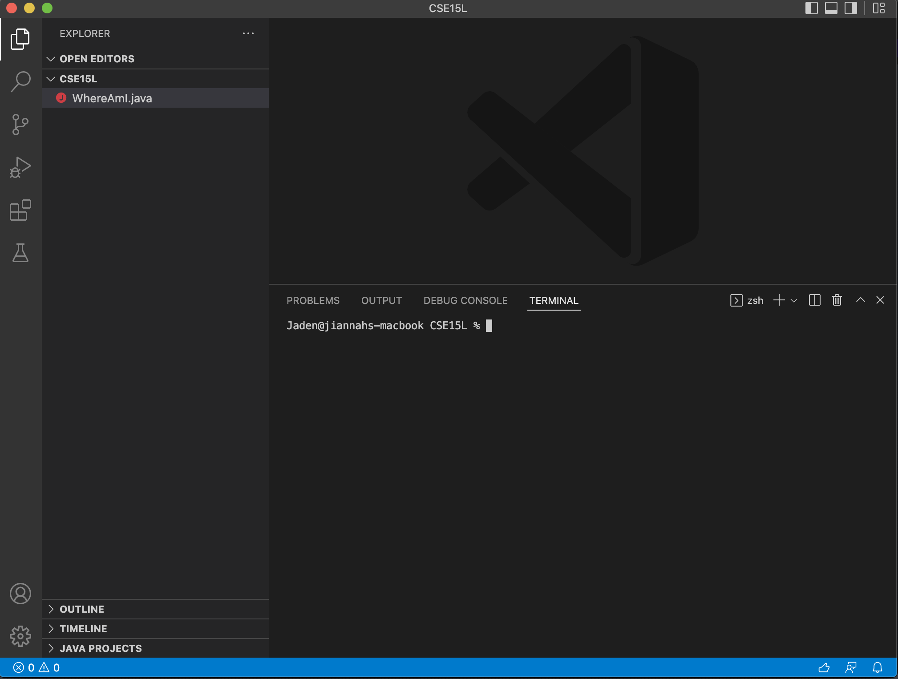
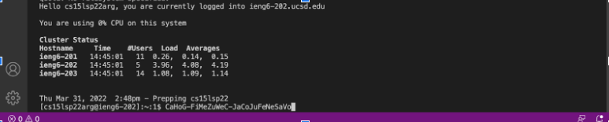
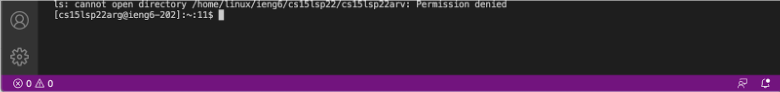
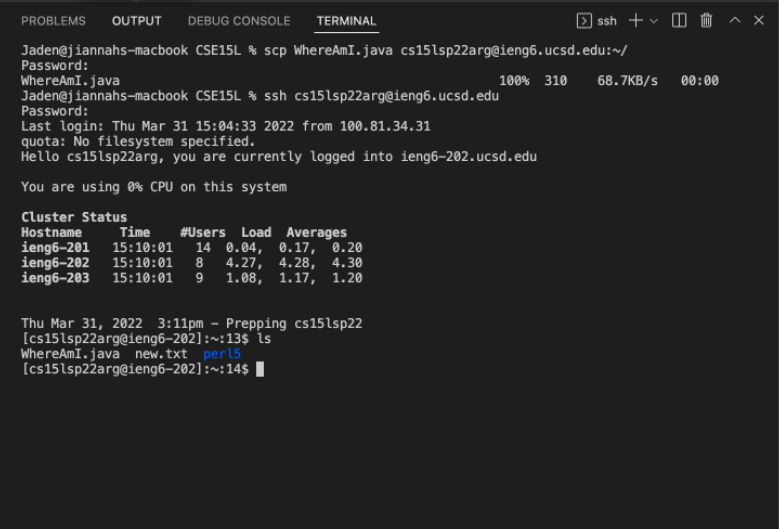
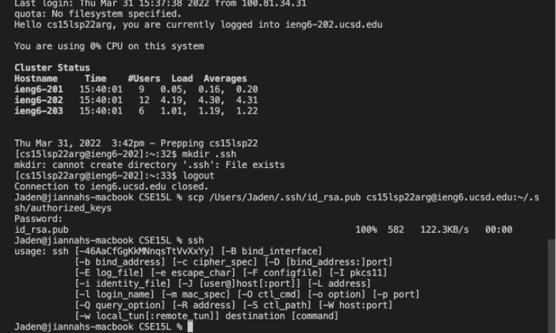

# Lab Report 1

### Installing VScode

 
Successfully downloaded VS code; I'm already pretty used to the IDE because of past courses such as CSE 8B. IDE allows for color coordination for different types, variables, and other categories.
 
[VS code download](https://code.visualstudio.com/download)

### Remotely Connecting

 
I connected to a server using `SSH` commands. The command first warns me about authenticity, which is for security. Then it prompts me to enter the password for the account, which allowed me to establish connection.
 
[Account lookup link UCSD](https://sdacs.ucsd.edu/~icc/index.php)

### Trying Some Commands

 
This command was short but unique one, where I attempted to connect to a different address (one of my lab groupmates) using `ls <directory>` with a changed username. The terminal stated "Permission denied" which demonstrates the security of the process, even when the address I tried to connect to was within the same folder as mine.

### Moving Files with scp

 
Using the `scp` command, I was able to move two files, WhereAmI.java (given by the lab) and test text file. After running the `scp` command, I reconnected to serverside and used the command to list the files, and it displayed the two.
 
[Link to help transfer files](https://linuxize.com/post/how-to-use-scp-command-to-securely-transfer-files/)

### Setting an SSH Key

 
The process of retyping a password gets grueling and annoying. The SSH key allows me to access the server file using a copy on the client side. After creating these public/private keys, I am able to make changes without constantly having to type in my password.
 
[Setting up SSH keys tutorial](https://www.digitalocean.com/community/tutorials/how-to-set-up-ssh-keys-2)
 
[SSH-Add steps provided by lab pdf](https://docs.microsoft.com/en-us/windows-server/administration/openssh/openssh_keymanagement#user-key-generation)

### Optimizing Remote Running

 
Using in-line commands on the terminal, I am able to run things more efficiently, rather than having to type lines of code over and over again. In the screenshot included, I use a shortcut where I use quotations after I run SSH to immediately run the command `ls` without having to type two lines of code.
