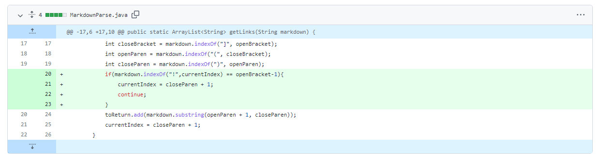
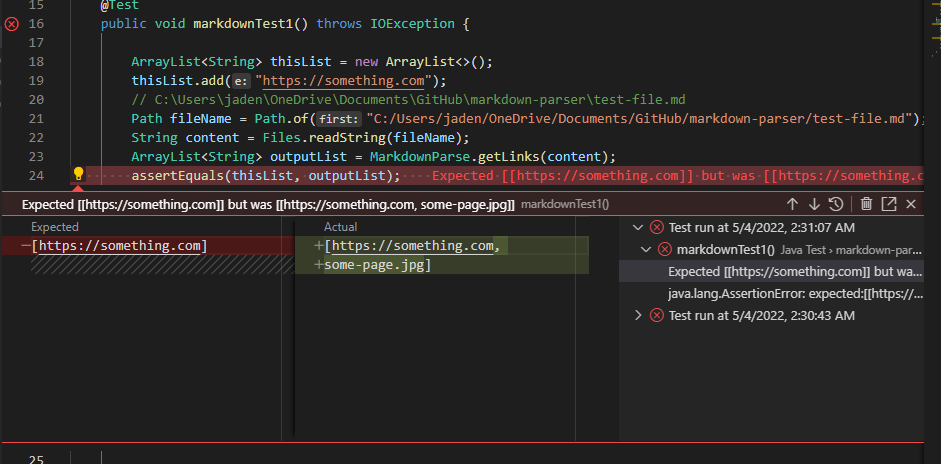
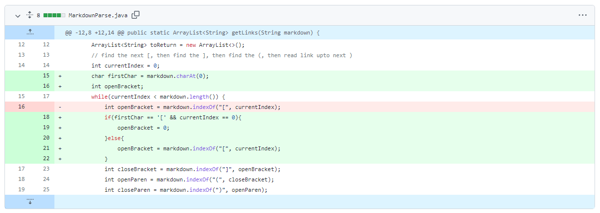
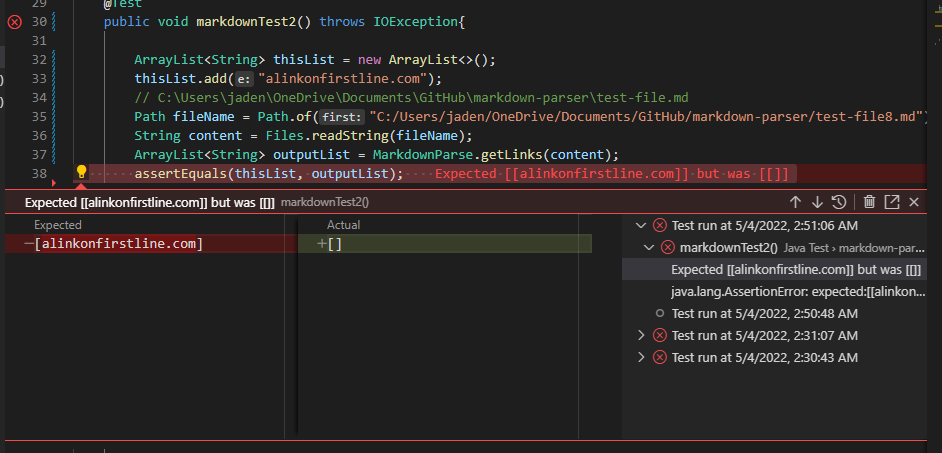
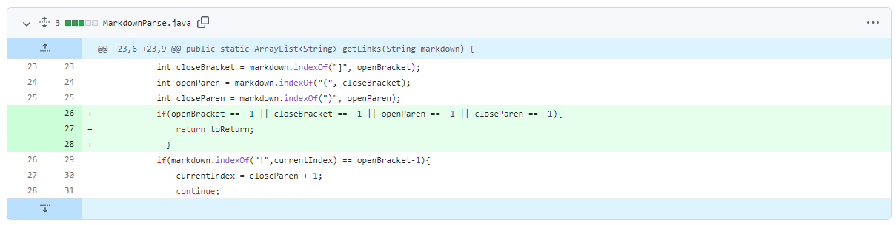
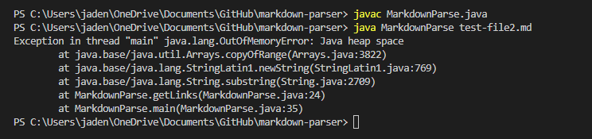

# Lab Report 2

### File with image reference
Code change diff screenshot:

[Link to test file with failure-inducing input](https://jadenbanawa.github.io/markdown-parser/test-file.md)

The symptom that the code encountered was that the MarkdownParse method getLinks was returning an array that included an image source link, when it is not supposed to. The failure inducing input is the prevalence of an image link. This is because, in the getLinks method, there is no code that approaches the syntax of an image link, which is the same as a normal link, except with an exclamation point.

### File that starts with a link
Code change diff screenshot:

[Link to test file with failure-inducing input](https://jadenbanawa.github.io/markdown-parser/test-file8.md)

The symptom of the test file's input that the code did not run correctly to where it can approach the file with a link in the first line. The failure-inducing input is the test-file with the link in the first line of the file. This is because, initially, the current index is already set to 0, which means that the indexOf method would not be able to access the variable openBracket. 

### File that has characters after link
Code change diff screenshot:

[Link to test file with failure-inducing input](https://jadenbanawa.github.io/markdown-parser/test-file2.md)

The failure inducing input is a file with a link that has characters or lines after which aren't links themselves. The symptom that is given is an infinite loop that runs while the code tries to find the next openBracket variable. The bug is in the MarkdownParse file, for it doesn not contain the code that ends the loop given that there is not another link after the first.

