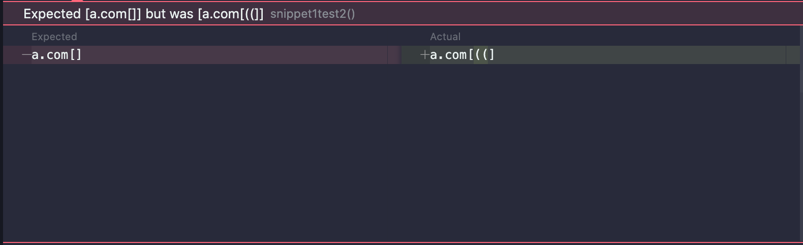

# Lab Report 4

## Links
[My Repository](https://github.com/jadenbanawa/markdown-parser) 
 
[Week 7 Implementation](https://github.com/UDXS/markdown-parser)

## Snippet 1 Tests

### Expected output for snippet 1:

 
As seen in the image, using the getLinks method in MarkdownParse.java should return an array of only one link, which is "another link" linked to \`google.com.
 
### Test snippet 1:

 
I added a file "snippet1.md" into the repository with the given snippet, and used the  `getLinks` method from MarkdownParser.java to get an output. I then used an expected static array, and used the `assertArrayEquals` to test if they match.
 

## Test output for my implementation:

 
In my implementation of getLinks, it does not handle the given file correctly. It stores the first url incorrectly into the array, but does not store the expected link.
 

## Test output for the Week 7 implementation:

 
The output for the week 7 implementation also failed. However, their getLinks method returned an array that had included "ucsd.com". 
 

## Code fix:
 
I believe that these issues can be solved with a short and less-involved code change. It would need to check if the text inside the square brackets have backticks by using the index variables of the brackets and checking if backtick characters both are after the first index and before the last. To check if a backtick precedes the entire line, it needs to check the index before the first square bracket.

 
## Snippet 2 Tests
 
### Expected output for snippet 2:

 
As seen in the image, using the getLinks method in MarkdownParse.java should return an array of three links. The nested link "a.com" should be included, as well as the parenthesized link and the link with escaped brackets.
 

### Test snippet 2:

 
I added a file "snippet2.md" into the repository with the given snippet, and used the  `getLinks` method from MarkdownParser.java to get an output. I then used an expected static array, and used the `assertArrayEquals` to test if they match.
 

## Test output for my implementation:

 
In my implementation of getLinks, it does not handle the given file correctly. It shows that it failed at the first element in the array, and that my implementation skipped the nested link. It also shows that It does not handle the parenthesized link, shown by the broken output.
 

## Test output for the Week 7 implementation:

 
The output for the week 7 implementation also failed. In the test, it shows that the link did not include the end of the parenthesized link.
 

## Code fix:
 
I believe that these issues can be solved with a longer code change. Since there are multiple issues in this snippet - the nested link, parenthesized link, and the escaped brackets - more conditionals and lines would need to be added. This includes restarting the indexing when the code encounters a duplicate character (such as another left square bracket) before it encounters the end of the link.
 
 
## Snippet 3 Tests
 
### Expected output for snippet 3:

 
As seen in the image, using the getLinks method in MarkdownParse.java should return an array of one link, which is the long link in the middle. It should contain the link "https://sites.google.com/eng.ucsd.edu/cse-15l-spring-2022/schedule".
 

### Test snippet 3:

 
I added a file "snippet3.md" into the repository, and used the  `getLinks` method from MarkdownParser.java to get an output. I then used an expected static array, and used the `assertArrayEquals` to test if they match.
 
 
## Test output for my implementation:

 
In my implementation of getLinks, it does not handle the given file correctly. Because the link that needed to be added had a lot of empty characters, my method treated it as part of the link. This screenshot shows that their lengths differed, because the correct implementation would not have included the blank characters.
 
## Test output for the Week 7 implementation:

 
The output for the week 7 implementation also failed. Their implementation could not handle the link at all, resulting in an empty array.
 
## Code fix:
 
I believe that these issues can be solved with a short and less-involved code change. The method would add the entire link into the array (newlines included), and it would use a loop to iterate within the link and make sure there is no whitespace. This would result in the accurate link.
 
